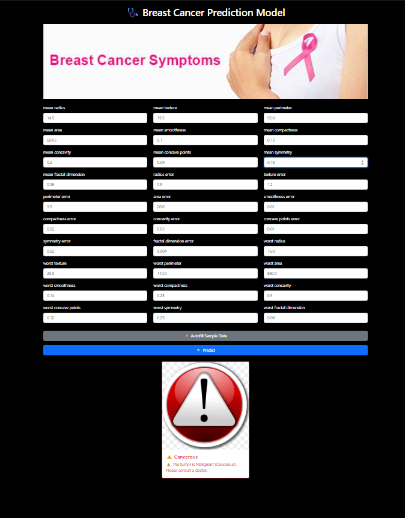

# 🩺 Breast Cancer Detection using Machine Learning + Flask App  

## 📌 Problem Statement  
Breast cancer is one of the most common cancers among women worldwide. Early detection can significantly increase the chances of successful treatment.  
This project builds a **Machine Learning model** using **Logistic Regression** to predict whether a tumor is:  
- **Malignant (Cancrous)**  
- **Benign (Not Cancrous)**  

The trained model is then deployed in a **Flask web app** with a simple UI where users can input tumor features and get predictions instantly.  

---

## 📂 Project Structure  
├── app.py                # Flask app (backend)  
├── models/  
│   └── model.pkl         # Trained Logistic Regression model  
├── requirements.txt      # Dependencies  
├── templates/  
│   └── index.html        # Frontend (form + results)  
├── static/               # Images, CSS, JS  
│   ├── img.jpg  
│   ├── okay_img.jpg  
│   └── alert_imge.png  
└── README.md             # Project documentation  

---

## ⚙️ Installation & Setup  
1. **Clone the repository**  
   ```bash
   git clone https://github.com/rjdecore/breast-cancer-detection-using-machine-learning-with-app.git
   cd breast-cancer-detection-using-machine-learning-with-app


# Create and activate a virtual environment
- python -m venv venv
- Windows (PowerShell):
- venv\Scripts\activate
# Install dependencies
- pip install -r requirements.txt
# 🧠 Machine Learning Workflow

- Dataset: Breast Cancer dataset (from sklearn / UCI dataset).

- Preprocessing: Dropped id column, label encoding for target (diagnosis).

- Feature Scaling: StandardScaler applied to features.

- Model Training: Logistic Regression with GridSearchCV for hyperparameter tuning.

- Model Selection: Best estimator saved as model.pkl.

- Deployment: Flask app loads model.pkl and predicts on new inputs.
# 📸 Screenshot
## 📸 Screenshot  



# 🚀 Future Improvements

- Add support for multiple ML models (Random Forest, SVM, XGBoost).

- Improve frontend design with Bootstrap/Tailwind.

- Provide REST API endpoints for JSON predictions.

- Deploy on Streamlit for interactive data exploration.

- Containerize with Docker for portability.
