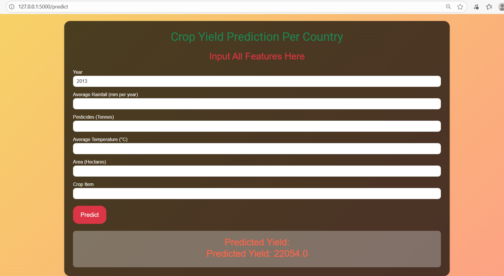

# 🌾 Crop Yield Prediction – Enhancing Agriculture with Machine Learning


---

## **Table of Contents**
1. [Problem Statement](#problem-statement)
2. [Project Overview](#project-overview)
3. [Technologies & Libraries](#technologies--libraries)
4. [Project Structure](#project-structure)
5. [How It Works](#how-it-works)
6. [Web Interface Screenshots](#web-interface-screenshots)
7. [Installation & Setup](#installation--setup)
8. [Future Enhancements](#future-enhancements)
9. [Author](#author)

---

## **Problem Statement**

Agriculture is highly dependent on environmental conditions such as rainfall, temperature, pesticide usage, and the cultivated area. Accurate crop yield prediction helps farmers and policymakers make informed decisions about crop planning, resource allocation, and food security.

**Objective:** Build a machine learning model to predict crop yields based on historical environmental data and crop-specific features, and provide an interactive web application for user-friendly predictions.

---

## **Project Overview**

This project leverages Python, scikit-learn, and Flask to create a predictive model with a web interface.

**Workflow:**
1. **Data Collection & Preprocessing**
   - Collected historical crop data (`Year`, `Average Rainfall`, `Pesticides Used`, `Average Temperature`, `Area`, `Crop Type`).
   - Handled missing values, encoded categorical variables, scaled numeric features using `ColumnTransformer` and `OneHotEncoder`.
2. **Model Training**
   - Trained a **Decision Tree Regressor**.
   - Evaluated model performance using **RMSE** and **R² Score**.
3. **Model Deployment with Flask**
   - Built a **Flask web application** for interactive predictions.
   - Users can input environmental and crop features and receive predicted yield instantly.

---

## **Technologies & Libraries**

- **Python** – Core programming  
- **Pandas & NumPy** – Data manipulation and numerical operations  
- **scikit-learn** – Machine learning and preprocessing  
- **Flask** – Web application framework  
- **Pickle** – Saving and loading trained models  
- **HTML/CSS** – Front-end interface  

---

## **Project Structure**

Predicting-Crop-Yields/
│
├── models/
│ ├── dtr.pkl # Trained Decision Tree model
│ └── preprocessor.pkl # Preprocessing pipeline
│
├── templates/
│ └── index.html # Web interface
│
├── static/
│ └── images/ # Screenshots
│
├── app.py # Flask application
├── requirements.txt # Python dependencies
└── README.md # Project documentation


---

## **How It Works**

1. User visits the home page (`index.html`).  
2. Inputs data:
   - Year  
   - Average Rainfall per Year (mm)  
   - Pesticides Used (Tonnes)  
   - Average Temperature (°C)  
   - Area  
   - Crop Type  
3. Clicks **Predict Yield**.  
4. Flask backend:
   - Strips whitespace from inputs.
   - Converts numeric inputs to float.
   - Uses preprocessor to encode features.
   - Runs the model to predict yield.  
5. Prediction is displayed on the same page.

---

## **Web Interface Screenshots**

**Home Page:**  
  

**Prediction Output:**  
  

> ⚠️ Replace these with actual screenshots of your app.

---

## **Installation & Setup**

1. Clone the repository:
```bash
git clone https://github.com/your-username/Predicting-Crop-Yields.git
cd Predicting-Crop-Yields
