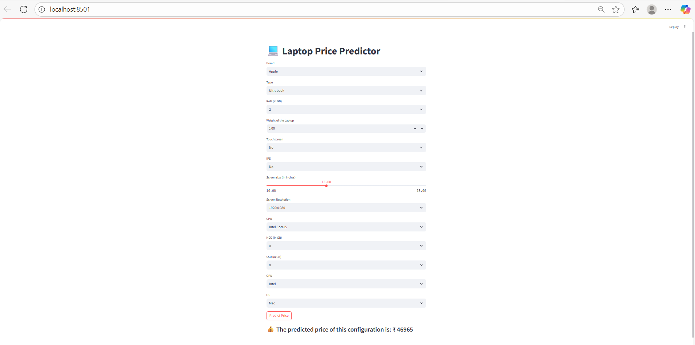

## 💻 Laptop Price Predictor (Streamlit + ML Pipeline)
**📌 Project Overview**

**This project is a Machine Learning web application built with Streamlit that predicts the price of a laptop based on its configuration.
The ML model is trained on a dataset of laptops with various specifications (brand, type, RAM, CPU, GPU, storage, etc.) and their prices.**

**Users can input laptop specs in the Streamlit app, and the model will return the predicted price.**

# ⚙️ Features

- Interactive Streamlit UI to select laptop specifications

- Preprocessing pipeline with feature engineering

- Machine Learning model trained using XGBoost

- Automatic price prediction based on entered configuration

## 🧹 Data Preprocessing & Feature Engineering

- The raw dataset contained messy text values and required extensive preprocessing. Key steps:

- Handling Categorical Columns

- Extracted Company, TypeName, Cpu brand, Gpu brand, and os

- Grouped rare categories into "Other" for better generalization

- RAM Conversion

- Converted RAM column from strings (like "8GB") into integers

- Weight Conversion

- Cleaned weight column (removed "kg" and converted to float)

- Touchscreen & IPS Columns

- Converted "Yes"/"No" into binary 0/1

- Screen Resolution → PPI (Pixels Per Inch)

- Extracted resolution (e.g., 1920x1080) into X_res and Y_res

**Created a new feature:**

**𝑃𝑃𝐼** =𝑋𝑟𝑒𝑠2 +𝑌𝑟𝑒𝑠2
Screen Size (inches)
PPI=Screen Size (inches)Xres2 +Yres2
**CPU Feature**
- Extracted brand info like "Intel Core i5", "AMD Ryzen", "Other"
- GPU Feature
- Extracted brand info like "Nvidia", "AMD", "Intel", "Other"
- Operating System (OS)
- Simplified into categories: Windows, Mac, Linux, Other
- Storage (HDD & SSD)
- Separated total storage into two columns:
- HDD
- SSD

**Target Variable**

-Log-transformed the price column (np.log(price)) to normalize distribution

## 📊 Model Training

- Used ColumnTransformer + Pipeline for preprocessing + modeling

- Tried different algorithms → selected XGBoost Regressor (best performance)

- Model evaluated using R² score and RMSE

-Saved trained pipeline as pipe.pkl

# 🚀 How to Run Locally
**1. Clone the repository**
git clone https://github.com/your-username/laptop-price-predictor.git
cd laptop-price-predictor

**2. Install dependencies**
pip install -r requirements.txt

**3. Run the Streamlit app**
streamlit run app.py

📂 Project Structure
├── app.py                 # Streamlit app
├── pipe.pkl               # Trained ML pipeline
├── df.pkl                 # Processed dataset (for dropdowns)
├── requirements.txt       # Dependencies
└── README.md              # Project documentation

🖼️ App Screenshot
## 🖼️ App Screenshot

**(screenshot of your Streamlit app)**

# 📈 Example Prediction

Input:

Brand: Dell

Type: Gaming

RAM: 16GB

CPU: Intel Core i7

GPU: Nvidia

Storage: SSD 512GB, HDD 0GB

Screen: 15.6", 1920x1080, IPS, Touchscreen

# Output:
💰 Predicted Price: ₹78,432

# 🛠️ Tech Stack

- Python (NumPy, Pandas, Scikit-learn, XGBoost)

- Streamlit (for interactive web UI)

- Pickle/Joblib (for model serialization)

# 📌 Future Improvements

- Add more recent datasets for better accuracy

- Deploy on cloud platforms (Streamlit Cloud, AWS, GCP)

- Add model explainability (SHAP values, feature importance)

# ✨ Built with ❤️ by Rituraj
