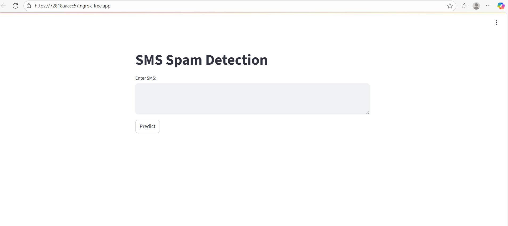
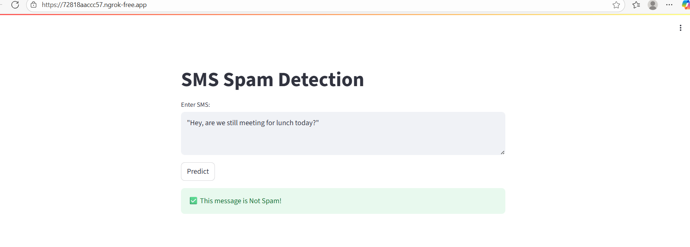
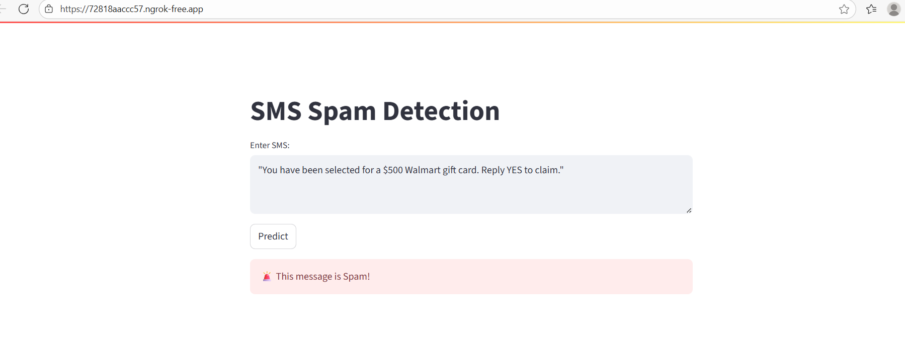

# SMS Spam Detection App

This project is an SMS Spam Detection system built using **Python**, **Scikit-learn**, and **Streamlit**. The app classifies SMS messages as **Spam** or **Not Spam (Ham)** using a **Multinomial Naive Bayes (MNB)** model trained on preprocessed text.

---

## 🔹 Project Overview

- **Objective:** Automatically detect whether an SMS message is spam or legitimate.
- **Techniques Used:**
  - Text preprocessing: tokenization, stopword removal, punctuation removal, stemming.
  - Feature extraction: **TF-IDF Vectorization**.
  - Model: **Multinomial Naive Bayes (MNB)**.
  - Web app: **Streamlit** for interactive user interface.

- **Why This Project:**  
  SMS spam is a common problem affecting millions of users. This project provides a **quick, automated way** to detect and filter spam messages.

---

## 🔹 Features

- Preprocesses SMS text to extract meaningful features.
- Predicts **Spam** or **Not Spam** for any input SMS.
- Interactive web app using Streamlit.
- Supports dense TF-IDF vectors for compatibility with the trained model.
- Can be extended to batch predictions or integrated with messaging systems.

## App Screenshot

Here’s how the SMS Spam Detection app looks:








---

## 🔹 Installation

1. **Clone the repository**
```bash
git clone <your-repo-url>
cd sms-spam-detection
